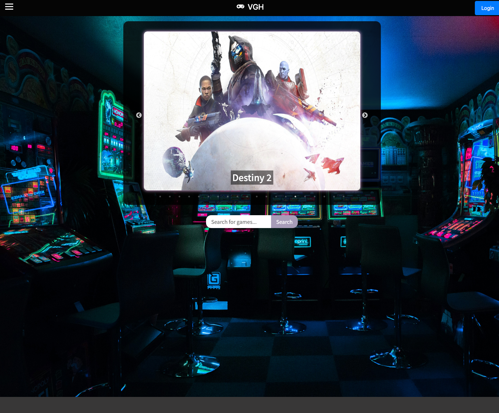
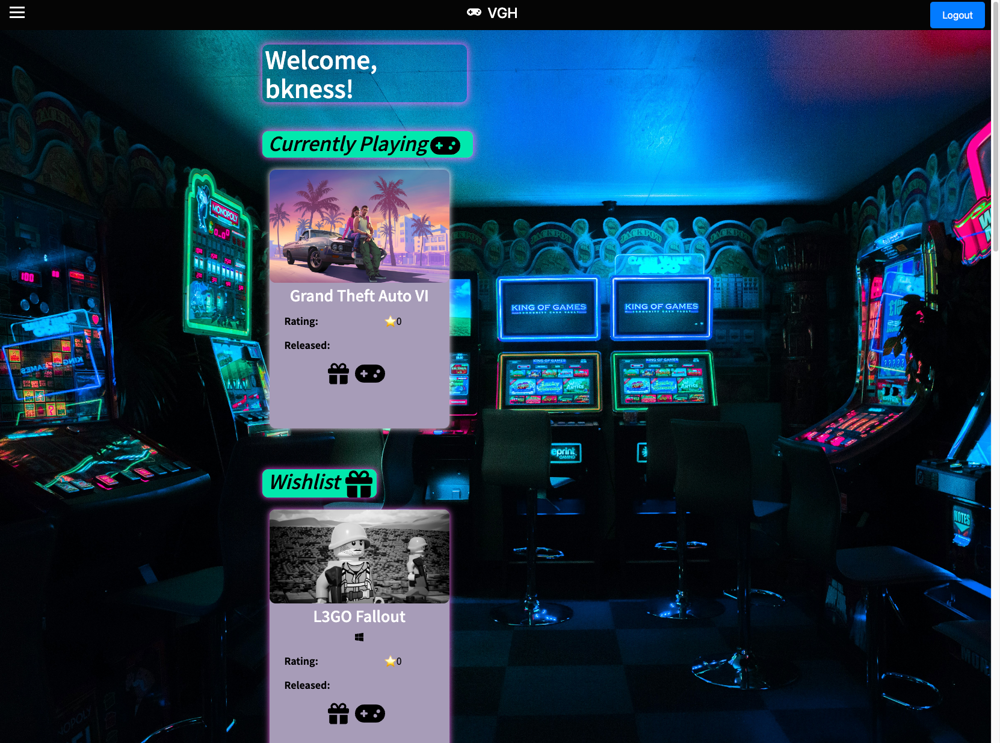
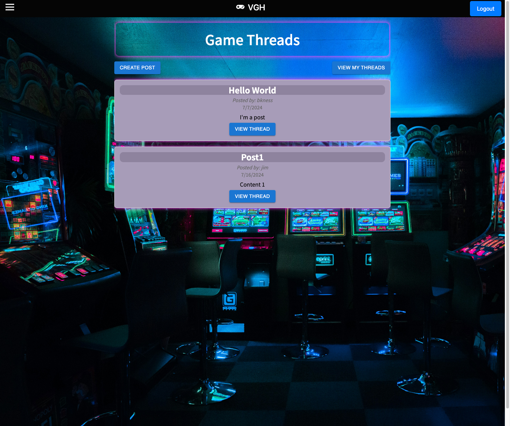
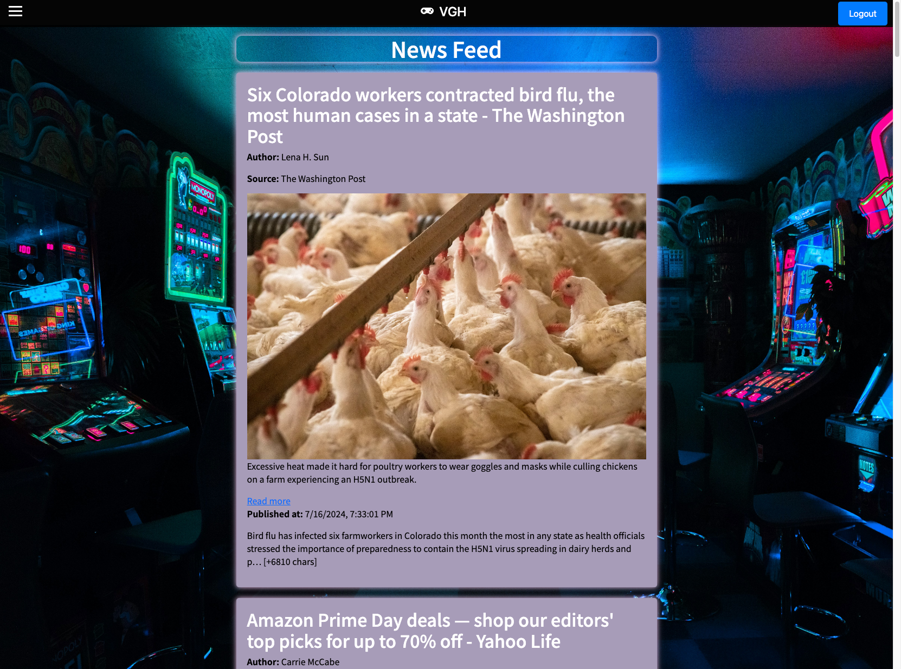

## Table of Contents

- [Installation](#installation)
- [Usage](#usage)
- [Credits](#credits)
- [License](#license)

# Video Game Hub

Welcome to Video Game Hub, the premier destination for gamers seeking a personalized and immersive gaming experience. Our platform goes beyond mere gameplay; it fosters a vibrant community where players can curate their gaming journey like never before.

### Features

Video Game Hub offers tailored features for the modern gamer:

- Showcase recently played games
- Craft wishlists
- Share latest pickups with fellow enthusiasts

But that's just the beginning. Our forum serves as a bustling hub for discussions on all aspects of gaming, connecting players, friends, and creators.

### Customization

What sets Video Game Hub apart is its dedication to customization. Whether you're forming new connections, following relevant players, or discovering like-minded friends, our platform empowers users to shape their gaming world according to their unique preferences and interests.

### Join Us

Join us at Video Game Hub and unlock a world of limitless possibilities. Shape, share, and enjoy your gaming journey with us – the ultimate destination for gamers, by gamers.

## Installation

1. Clone the repository:

   ```sh
   git clone https://github.com/your-username/your-project.git
   cd your-project
   ```

2. Install dependencies:

   ```sh
   npm install
   ```

3. Build the project (from the root folder):

   ```sh
   npm run build
   ```

4. Start the development server from the client folder:

   ```sh
   cd client
   npm run develop
   ```

5. Start the server from the root folder:

   ```sh
   cd ..
   npm run start
   ```

### Additional Notes

- Ensure you have the necessary environment variables set up in a `.env` file in the root directory. Refer to `.env.example` for required variables.
- If you encounter any issues, check the project's documentation or open an issue on the repository.

## Usage

- Open your browser and navigate to [http://localhost:3002](http://localhost:3002) to view the application.
- Alternatively, visit our website at [Video Game Hub](https://video-gaming-hub.onrender.com/)

## Screenshots






## Credits

- Brandon Kelly - https://github.com/bkness
- Dylan Horyza - https://github.com/dylanhoryza
- Spencer Henegar - https://github.com/HenegarCodes
