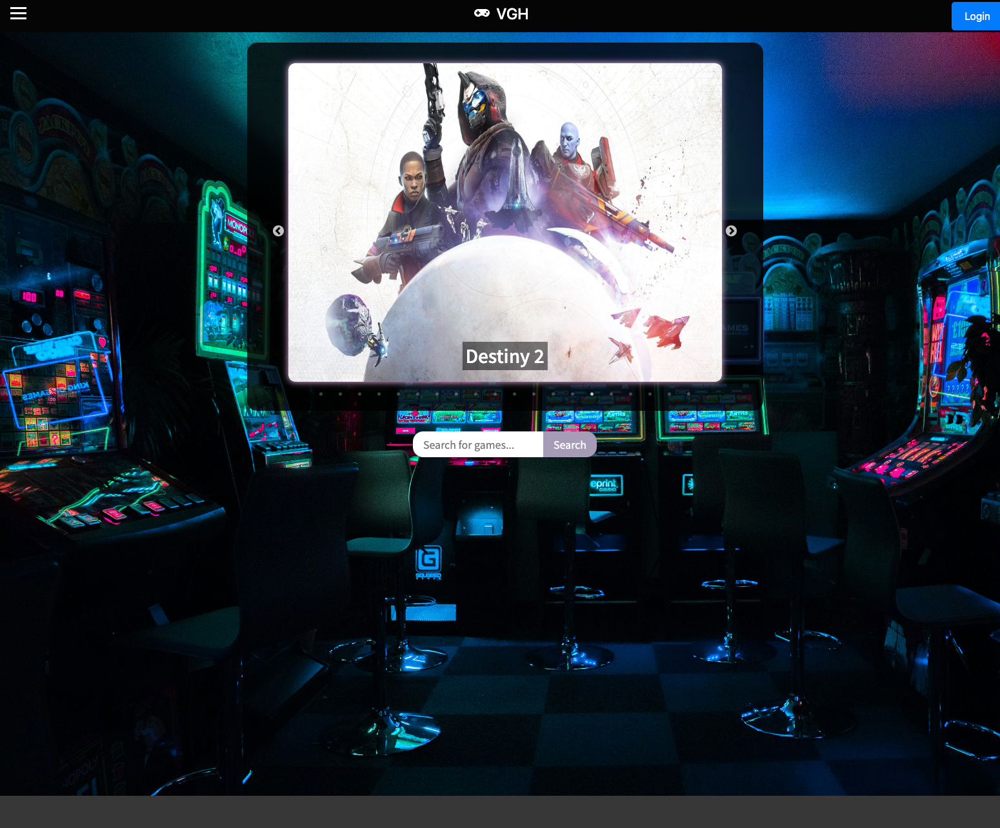
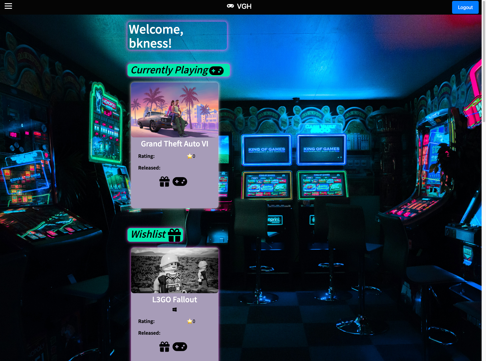
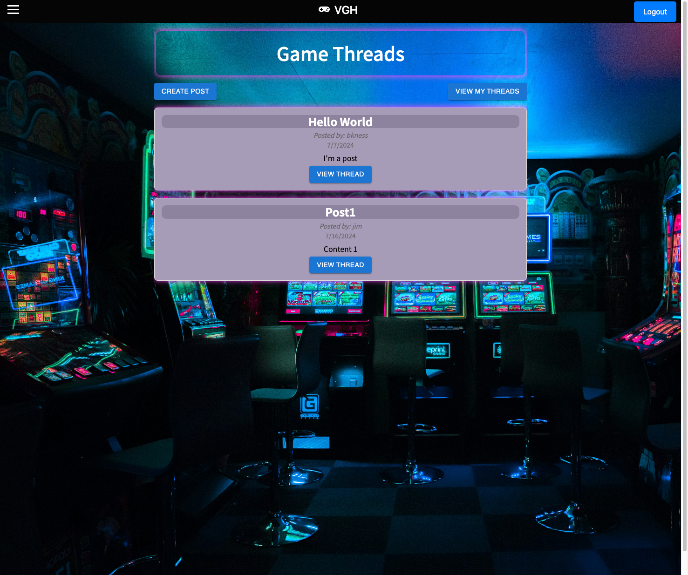
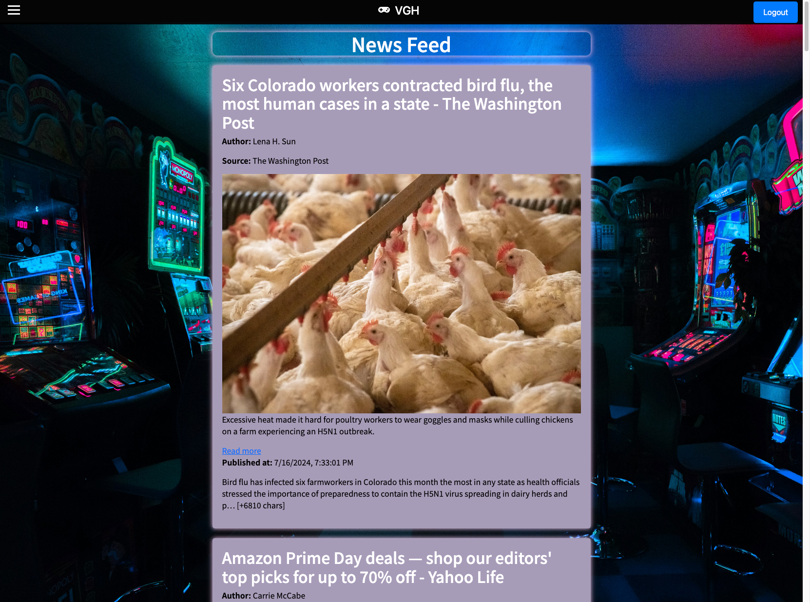

# Video Game Hub

Welcome to Video Game Hub — a community platform for gamers to discover games, track what they're playing, build wishlists, and connect through forums and news.

## Features

- Game search powered by the RAWG API with a carousel of top titles
- Forum with threads and comments
- Gaming news feed
- Wishlist and currently-playing tracker (auth required)
- JWT-based authentication

## Tech Stack

**Client:** React, Apollo Client, GraphQL, Vite, MUI, Bootstrap  
**Server:** Node.js, Express, Apollo Server v4, Mongoose, MongoDB Atlas

## Installation

1. Clone the repository:

   ```sh
   git clone https://github.com/bkness/Video-Gaming-Hub.git
   cd Video-Gaming-Hub
   ```

2. Install all dependencies (root, server, and client):

   ```sh
   npm install
   ```

3. Create `server/.env` with the following variables:

   ```
   MONGODB_URI=mongodb+srv://<user>:<pass>@cluster.mongodb.net/videogame_db?retryWrites=true&w=majority
   RAWG_API_KEY=your_rawg_key
   NEWS_API_KEY=your_news_api_key
   JWT_SECRET=your_secret
   ```

4. Start the development server:

   ```sh
   npm run dev
   ```

   This runs both the Express/Apollo server on port 3001 and the Vite client on port 3002.

## Usage

- Visit [http://localhost:3002](http://localhost:3002) in your browser
- Live demo: [https://video-gaming-hub.onrender.com](https://video-gaming-hub.onrender.com)

## Screenshots






## Credits

- Brandon Kelly — https://github.com/bkness
- Dylan Horyza — https://github.com/dylanhoryza
- Spencer Henegar — https://github.com/HenegarCodes
